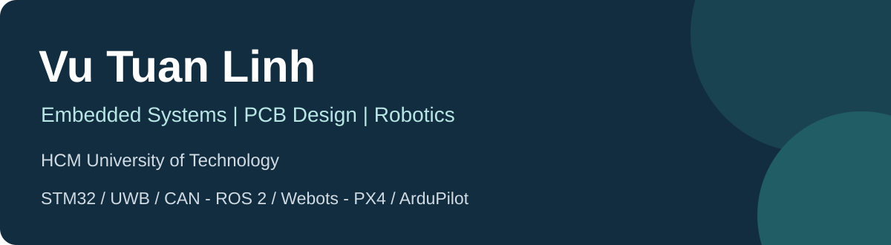
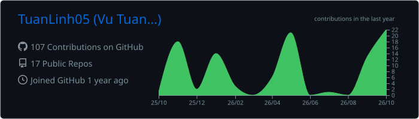

# Vu Tuan Linh

**English** · [Tiếng Việt](#tieng-viet)

I'm **Vu Tuan Linh**, a student at **HCM University of Technology (HCMUT)**. My projects bring together embedded firmware, custom electronics and robot control, from STM32 sensor interfaces to ROS 2 simulations and drone experiments.

This profile is a directory of the projects in my GitHub account. Each repository documents its own hardware/software setup, implementation scope and development notes.

## Project portfolio

### Embedded systems and sensing

| Project | Focus |
|---|---|
| [STM32-CAN-Network](https://github.com/TuanLinh05/STM32-CAN-Network) | H743/F407/F429 network, sensor acquisition and motor PID monitoring |
| [STM32-Temperature-Monitor](https://github.com/TuanLinh05/STM32-Temperature-Monitor) | Period-based sensing, STM32 filters, Windows chart and CSV |
| [STM32F429-IMU-AHRS](https://github.com/TuanLinh05/STM32F429-IMU-AHRS) | IMU, compass, barometer and attitude-estimation prototype |
| [HX711-Loadcell](https://github.com/TuanLinh05/HX711-Loadcell) | Load-cell measurement and RPM experiment |
| [PS2-Controller-for-Robot](https://github.com/TuanLinh05/PS2-Controller-for-Robot) | STM32 interface for a PS2 controller |

### UWB and indoor positioning

| Project | Focus |
|---|---|
| [DW1000_DISTANCE](https://github.com/TuanLinh05/DW1000_DISTANCE) | STM32/DW1000 ranging experiment |
| [DWM1001_UWB](https://github.com/TuanLinh05/DWM1001_UWB) | DWM1001 tag/anchor firmware, ESP32 gateway and monitoring |
| [UWB-For-Drone](https://github.com/TuanLinh05/UWB-For-Drone) | UWB positioning pipeline, filtering and web visualization |

### Robots, drones and simulation

| Project | Focus |
|---|---|
| [Quadruped-robot-12DOF](https://github.com/TuanLinh05/Quadruped-robot-12DOF) | Webots quadruped, C SMC controller, ROS 2 bridge and MATLAB |
| [ROS2_Webots_DOG](https://github.com/TuanLinh05/ROS2_Webots_DOG) | Unitree Go2 model and ROS 2/Webots control experiments |
| [SCARA-Robot](https://github.com/TuanLinh05/SCARA-Robot) | SCARA drawing robot, embedded firmware, GUI and simulation |
| [PX4-ROS2-Ground-Control](https://github.com/TuanLinh05/PX4-ROS2-Ground-Control) | PX4 SITL web dashboard, trajectory design and controller monitoring |
| [S500-Vision-Follow-Drone](https://github.com/TuanLinh05/S500-Vision-Follow-Drone) | Person detection, yaw-follow control and companion validation |
| [P4-Transwing-VTOL-Sim](https://github.com/TuanLinh05/P4-Transwing-VTOL-Sim) | Folding-wing VTOL simulation, control station and RC bridge |

### Hardware design and integration

| Project | Focus |
|---|---|
| [PIF_RYA_2025_Hardware](https://github.com/TuanLinh05/PIF_RYA_2025_Hardware) | STM32/CAN control board and MOSFET H-bridge design |
| [RFID_Door_Lock](https://github.com/TuanLinh05/RFID_Door_Lock) | Custom PCB, RFID/keypad firmware and access feedback |

## Tools across these projects

- **Firmware:** C/C++, STM32 HAL, ESP32, Nordic nRF52, Arduino, FreeRTOS and Zephyr.
- **Applications and analysis:** Python, C# WinForms, MATLAB/Simulink and serial/web interfaces.
- **Hardware:** Altium Designer and KiCad.
- **Robotics:** ROS 2, Webots, Gazebo, PX4 and ArduPilot.
- **Development:** Linux/Ubuntu, VS Code, Git and GitHub.

The repository READMEs distinguish implemented features, simulation assumptions and work that still needs hardware validation. Third-party code and model credits are retained in the relevant projects.

## GitHub activity

These cards are generated by the existing [profile-summary workflow](.github/workflows/profile-summary-cards.yml). They describe repository activity; project performance and validation results belong in each project's documentation.

## University and community

  
  

HCM University of Technology · Pay It Forward

---

## Tiếng Việt

[English](#english) · **Tiếng Việt**

Mình là **Vũ Tuấn Linh**, sinh viên **Trường Đại học Bách khoa - ĐHQG TP.HCM (HCMUT)**, quan tâm đến **hệ thống nhúng, thiết kế PCB và robotics**.

Các repo của mình gồm bốn nhóm:

- **Nhúng và cảm biến:** mạng CAN STM32, đo nhiệt độ, AHRS, loadcell và tay cầm PS2.
- **UWB:** đo khoảng cách DW1000, mạng tag/anchor DWM1001 và xử lý vị trí trong nhà.
- **Robot/drone:** quadruped Webots, SCARA, trạm điều khiển PX4, S500 vision-follow và VTOL cánh gập.
- **Phần cứng:** mạch điều khiển động cơ PIF RYA và khóa cửa RFID trên PCB tự thiết kế.

Xem các bảng ở [Project portfolio](#project-portfolio) để mở từng repo. README của mỗi dự án có cấu trúc file, công cụ, hướng dẫn chạy và giới hạn triển khai. Phần mô phỏng, prototype và tính năng đã có trong code được mô tả riêng để dễ theo dõi.

Các công cụ mình sử dụng trong portfolio gồm C/C++, Python, C#, MATLAB, STM32/ESP32/nRF52, Altium/KiCad, ROS 2, Webots, Gazebo, PX4 và ArduPilot. Ghi nhận source/model của bên thứ ba nằm trong repo tương ứng.

HCMUT · Pay It Forward · [GitHub TuanLinh05](https://github.com/TuanLinh05)
